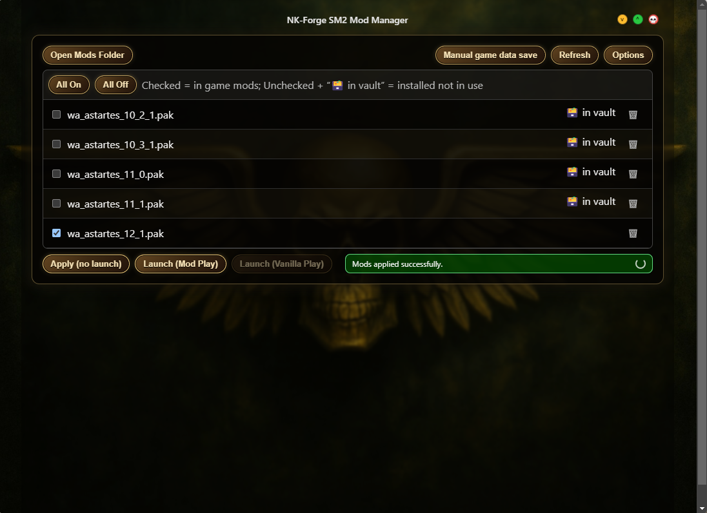

# NK-Forge Space Marine 2 Mod Manager

A Windows desktop mod manager and game launcher for **Warhammer 40,000: Space Marine 2**, built by **NK Forge**.



> **Current release: v1.0.5**
>
> Download the latest installer from [Nexus Mods](https://www.nexusmods.com/warhammer40000spacemarine2/mods/381?tab=files).

## Overview

The NK-Forge Space Marine 2 Mod Manager is designed to make switching between modded and vanilla play straightforward while keeping mod files, modded saves, and recovery snapshots organized.

### Highlights

- Detects **Steam**, **Xbox / PC Game Pass**, and **Epic Games** installations
- Dedicated **Mods Vault** for inactive mods
- Separate **Mod Play Vault** for modded save/config snapshots
- Toggle-based mod enabling and disabling
- **Apply (no launch)** workflow for preparing mods ahead of time
- Separate **Mod Play** and **Vanilla Play** launch paths
- Automatic save mirroring after tracked modded sessions
- Manual game-data save/mirroring on demand
- Watcher Activity panel for live file activity
- Configurable pre-reconcile backup retention
- Transactional backup creation so incomplete snapshots are never treated as valid backups
- About & Support panel with the installed application version

This tool is **Windows-only**.

## Platform Support

| Platform | Status | Notes |
| --- | --- | --- |
| Steam | Supported | Automatic install detection and Steam launch handling. |
| Xbox / PC Game Pass | Supported | Automatic detection and Xbox launch handling are included. |
| Epic Games | Experimental | Epic support is included, but remains less thoroughly field-tested than Steam/Xbox. |

If you use the Epic Games version and encounter a detection or launch issue, please include logs/screenshots when reporting it.

---

## What's New in v1.0.5

### Backup Retention

Pre-reconcile backups can be large, so v1.0.5 adds a user-controlled **Backup Retention** setting under **Options**.

- Select how many backups to keep: **1–10**
- Default retention: **3**
- Changing the setting takes effect after the next successful reconcile backup
- Older generated backups are pruned automatically
- Manual/unrelated folders are not removed by the retention cleanup

Default backup location:

```text
%APPDATA%\nkforge_sm2_mod_manager\backups\pre-reconcile
```

Backups are created transactionally: data is copied into a temporary snapshot first and only promoted to a retained backup after the copy completes successfully. Failed or partial copies are not counted as valid recovery snapshots.

### Reliability & Safety

v1.0.5 also includes:

- Collision-safe backup naming for rapid/concurrent reconciles
- Compatibility with backup folders created by earlier releases
- Corrected permanent mod deletion behavior
- Deterministic manager-owned backup storage
- Narrower Electron IPC boundaries
- Renderer navigation protections and Content Security Policy hardening
- Safe configured-folder reveal actions

### Support NK Forge

An optional **About & Support** section is available under **Options**. Supporting development is entirely optional and does not affect access to features, updates, or help.

[Support NK Forge on Ko-fi](https://ko-fi.com/nkforge)

---

## Installation

### Download

Download the latest installer from Nexus Mods:

**[NK-Forge SM2 Mod Manager — Files](https://www.nexusmods.com/warhammer40000spacemarine2/mods/381?tab=files)**

### Installation Steps

1. Download the current **Main File** from Nexus Mods.
2. Run the installer.
3. If Windows displays a SmartScreen/security warning, choose **More info → Run anyway** if you trust the downloaded release.
4. Launch the Mod Manager when installation completes.

The installer is not currently code-signed, so Windows may display an additional warning.

---

## Initial Setup

On first launch, the Setup Wizard attempts to detect the selected storefront installation and required paths, including:

- Space Marine 2 installation
- Save/config data
- Mods Vault
- Mod Play Vault

If a directory cannot be detected automatically, the wizard will allow you to select the appropriate location manually.

After setup, configured paths can be reviewed under **Options → Managed Paths**.

---

## Mods Vault

The **Mods Vault** stores installed mods that are not currently active in the game's mods directory.

Typical workflow:

1. Extract/install a compatible mod into the Space Marine 2 mods directory or Mods Vault.
2. Open or refresh the Mod Manager.
3. Check a mod to make it active or uncheck it to return it to the vault.
4. Click **Apply (no launch)** to reconcile the selected state.

The manager moves the managed mod entries between the active mods directory and Mods Vault as needed.

---

## Enabling and Disabling Mods

1. Open the Mod Manager.
2. Check the mods you want active.
3. Uncheck mods you want stored in the vault.
4. Click **Apply (no launch)** to reconcile the filesystem without launching the game.

A pre-reconcile recovery snapshot is created before the managed mod state is changed.

---

## Backup Retention

Open:

**Options → Backup Retention**

Use the slider to select **1–10** pre-reconcile backups to retain.

Because a snapshot can consume several gigabytes depending on your active mod set, choose a retention value appropriate for your available disk space.

The manager creates the newest backup first, confirms it completed successfully, and then removes older generated snapshots beyond the selected retention limit.

---

## Save Mirroring

The Mod Manager keeps a separate **Mod Play Vault** for modded save/config snapshots.

### Manual Game Data Save

Use **Manual game data save** to explicitly mirror the current tracked save/config data into the Mod Play Vault.

> **Important:** If your most recent session was vanilla play, a manual save can mirror that current vanilla data into the Mod Play Vault. If you are unsure, make a copy of the Mod Play Vault before performing a manual mirror.

### Automatic Mirroring

During a tracked modded launch:

1. The manager restores the Mod Play Vault data for modded play.
2. Space Marine 2 is launched through the detected storefront.
3. The manager monitors the game session and relevant file activity.
4. When the tracked game session ends, updated modded data is mirrored back to the Mod Play Vault.

Vanilla Play does not use the modded save-mirroring workflow.

---

## Launching Space Marine 2

### Mod Play

1. Enable the mods you want.
2. Click **Launch (Mod Play)**.

The manager reconciles the selected mod state, prepares mod-play data, launches the game through the configured storefront, and tracks the session for post-game mirroring.

### Vanilla Play

1. Disable the mods you do not want active.
2. Click **Launch (Vanilla Play)**.

Vanilla launch intentionally avoids the Mod Play Vault mirroring workflow.

---

## Watcher Activity

The **Watcher Activity** panel provides visibility into manager-observed file activity, including mod and save/config events used by the application workflows.

The display can be cleared without deleting your files.

---

## File Locations

Default manager data is stored under Electron's application-data directory:

```text
%APPDATA%\nkforge_sm2_mod_manager
```

Default locations include:

### Mods Vault

```text
%APPDATA%\nkforge_sm2_mod_manager\mods_vault
```

### Mod Play Vault

```text
%APPDATA%\nkforge_sm2_mod_manager\mod_play_vault
```

### Pre-Reconcile Backups

```text
%APPDATA%\nkforge_sm2_mod_manager\backups\pre-reconcile
```

The exact configured paths can be viewed under **Options → Managed Paths**.

> If you relocate a vault, existing backups in the old manager-data location are not automatically migrated.

---

## Troubleshooting

### Mods are not showing up

- Confirm the mod is extracted into the expected Space Marine 2 mods directory or Mods Vault.
- Click **Refresh** if files were added while the manager was already running.

### Game is not launching

- Ensure the appropriate storefront client is running when required.
- Review detected/configured paths under **Options → Managed Paths**.
- Include the storefront (Steam, Xbox / PC Game Pass, or Epic) when reporting the problem.

### A folder button does not open Explorer

Verify the corresponding configured path under **Options → Managed Paths**. The folder reveal actions only open manager-configured locations.

### Backups are consuming too much disk space

Open **Options → Backup Retention** and lower the retention value. The manager will prune older generated snapshots after the next successful reconcile backup.

### Auto-detection failed

Non-default or relocated installations may require manual path selection during setup.

---

## Recommended Workflow

1. **Complete setup** and verify the detected storefront and paths.
2. **Add mods** to the active mods directory or Mods Vault.
3. **Refresh** the manager if files were added while it was running.
4. **Select mods** and use **Apply (no launch)** to prepare the desired state.
5. Use **Launch (Mod Play)** for a tracked modded session or **Launch (Vanilla Play)** for vanilla play.
6. Leave the manager running during tracked Mod Play sessions so post-game mirroring can complete.
7. Set **Backup Retention** based on the amount of disk space you want dedicated to recovery snapshots.

---

## Support

When reporting an issue, please include:

- Mod Manager version
- Storefront: Steam, Xbox / PC Game Pass, or Epic Games
- Windows version
- Description of what happened
- Relevant logs/screenshots when possible

### Links

- **Nexus Mods:** https://www.nexusmods.com/warhammer40000spacemarine2/mods/381?tab=files
- **Discord:** https://discord.gg/y8G8ptxjGu
- **Email:** dev@nkforge.com
- **NK Forge:** https://nkforge.com
- **Ko-fi:** https://ko-fi.com/nkforge

---

## Development

Install dependencies:

```bash
npm install
```

Run the development environment:

```bash
npm run dev
```

Type-check:

```bash
npm run type-check
```

Build production assets:

```bash
npm run build
```

Create the Windows installer/package:

```bash
npm run dist
```

> `npm start` launches the built Electron main process directly and is not the normal Vite development workflow. Use `npm run dev` for local development.

---

## License

This project is licensed under the **MIT License**. See [LICENSE](LICENSE) for details.

---

## Thank You

Thank you for using the NK-Forge Space Marine 2 Mod Manager and for reporting issues as the project evolves. Community feedback directly helps improve reliability, compatibility, and the safety of the mod-management workflow.
